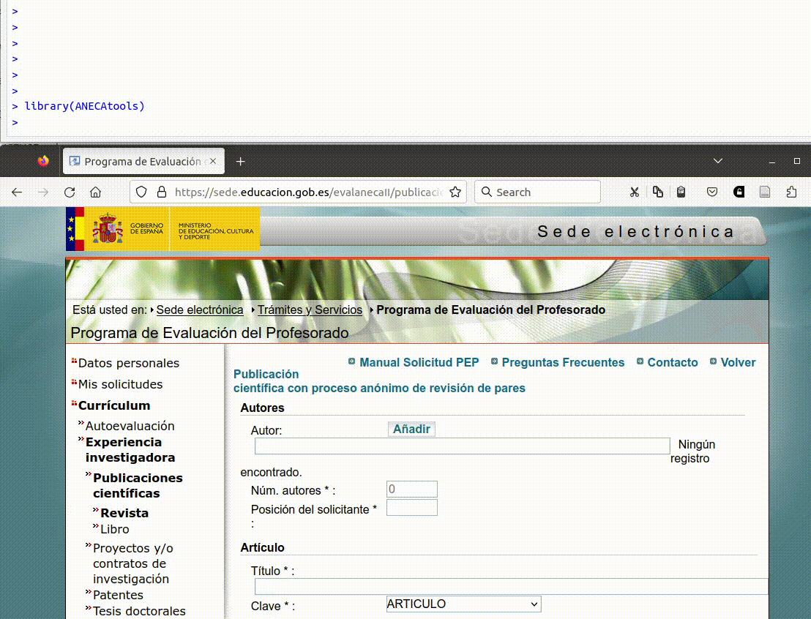

<!-- README.md is generated from README.Rmd. Please edit that file -->

```{r, include = FALSE}
knitr::opts_chunk$set(
  collapse = TRUE,
  comment = "#>",
  fig.path = "man/figures/README-",
  out.width = "100%"
)
```

# ANECAtools

<!-- badges: start -->
<!-- badges: end -->

ANECAtools es un paquete de R con herramientas para facilitar el proceso de solicitud de acreditación de profesorado ante la ANECA, automatizando tareas en lo posible. 

Entre otras funciones, ANECAtools facilita y agiliza la introducción de los datos de publicaciones a partir de un archivo BibTeX. 

También incluye funciones para extraer automáticamente la página inicial y final de muchos archivos PDF a la vez, así como agruparlos en un único archivo listo para subir a la plataforma.

## Instalación

``` r
# install.packages("remotes")  # instala el paquete remotes si no lo tienes instalado
remotes::install_github("Pakillo/ANECAtools")
```

## Ejemplos de uso

`library(ANECAtools)`

### Introducir publicaciones

`introducir_publicaciones("mis_papers.bib")`




### Extraer páginas de archivos pdf

Extraer página inicial y final de un archivo PDF:

```{r eval=FALSE}
pdf_extraer_pags("articulo.pdf")
```

Extraer página inicial y final de muchos PDF a la vez:

```{r eval=FALSE}
archivos <- list.files("carpeta_pdfs", full.names = TRUE)
lapply(archivos, pdf_extraer_pags)
```


### Combinar pdfs en un único archivo

```{r eval=FALSE}
pdfs <- list.files("PDF_SUBSET", full.names = TRUE)
pdf_combinar(pdfs)
```


