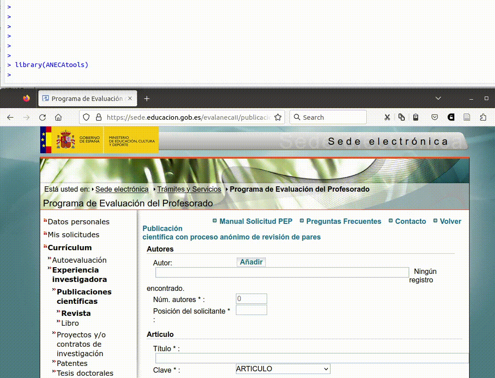

<!-- README.md is generated from README.Rmd. Please edit that file -->

# ANECAtools

<!-- badges: start -->

[](https://github.com/Pakillo/ANECAtools/actions/workflows/R-CMD-check.yaml)
[](https://hits.dwyl.com/Pakillo/ANECAtools)
[](https://hits.dwyl.com/Pakillo/ANECAtools)

<!-- badges: end -->

ANECAtools es un paquete de R con herramientas para facilitar el proceso
de solicitud de acreditación de profesorado ante la
[ANECA](https://www.aneca.es/), automatizando tareas en lo posible.
Puede ayudarte a introducir la información mucho más rápido, tanto en la
aplicación [PEP](https://www.aneca.es/personal-contratado) como
[ACADEMIA](https://www.aneca.es/personal-funcionario).

Entre otras funciones, ANECAtools facilita y agiliza la introducción de
los datos de publicaciones a partir de un archivo BibTeX.

También permite extraer automáticamente la página inicial y final de
muchos archivos PDF a la vez, así como agruparlos en un único archivo
listo para subir a la plataforma.

## Instalación

Para usar ANECAtools tienes que tener R instalado. Puedes descargarlo
gratuitamente en <https://cran.r-project.org/>. Además recomiendo
instalar una interfaz como Rstudio:
<https://posit.co/download/rstudio-desktop/>.
[Aquí](https://datacritica.org/2021/03/18/instalacion-de-r-y-rstudio-en-windows/)
tienes todo el proceso explicado paso a paso.

Además es necesario tener instalado el paquete `remotes` para instalar
ANECAtools desde GitHub. Una vez abierto R/Rstudio, ejecutar

``` r
install.packages("remotes")  # instala el paquete remotes si no lo tienes instalado
```

También puede ser necesario instalar Rtools. Para comprobarlo, ejecutar:

``` r
install.packages("pkgbuild")  
pkgbuild::has_build_tools()
```

Entonces ya podremos instalar ANECAtools:

``` r
remotes::install_github("Pakillo/ANECAtools")
```

## Ejemplos de uso

`library(ANECAtools)`

### Introducir publicaciones

Para introducir los datos de las publicaciones (autores, título,
revista, páginas, ISSN, etc) simplemente tenemos que pasarle un archivo
con las referencias en formato BibTex. Este archivo podemos generarlo a
partir de muchas fuentes, por ejemplo exportando nuestras referencias
desde Zotero.

`introducir_publicaciones("mis_papers.bib")`



Si quieres ir más rápido o lento, puedes ajustar la velocidad de pegado
(ver
[ayuda](https://pakillo.github.io/ANECAtools/reference/introducir_publicaciones.html)
de la función).

### Extraer páginas de archivos pdf

Extraer página inicial y final de un archivo PDF:

``` r
pdf_extraer_pags("articulo.pdf")
```

Extraer página inicial y final de muchos PDF a la vez:

``` r
archivos <- list.files("carpeta_pdfs", full.names = TRUE)
lapply(archivos, pdf_extraer_pags)
```

### Combinar pdfs en un único archivo

``` r
pdfs <- list.files("PDF_SUBSET", full.names = TRUE)
pdf_combinar(pdfs)
```
